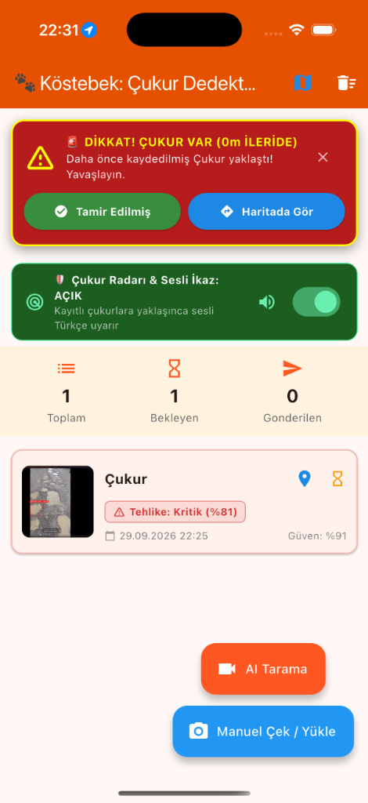
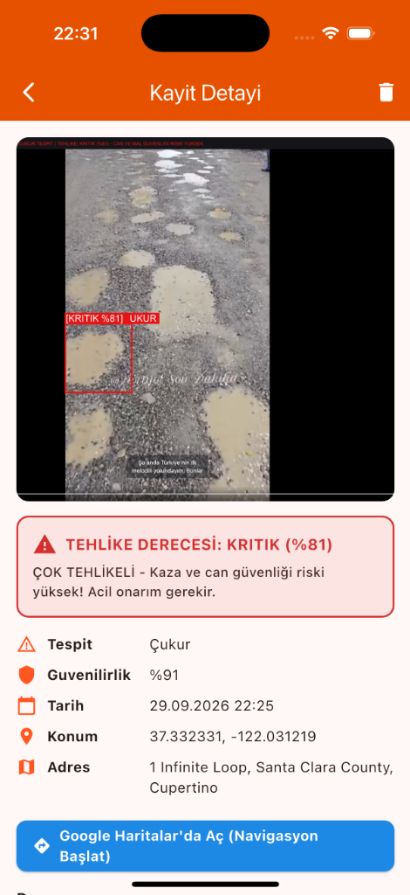
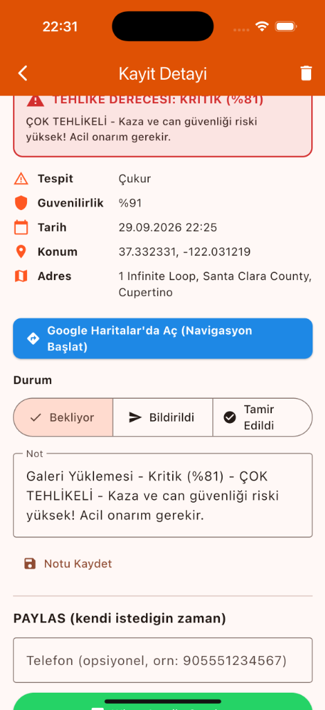
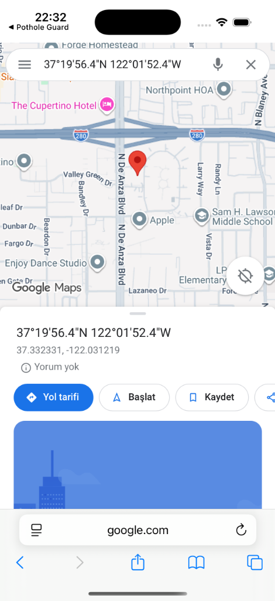
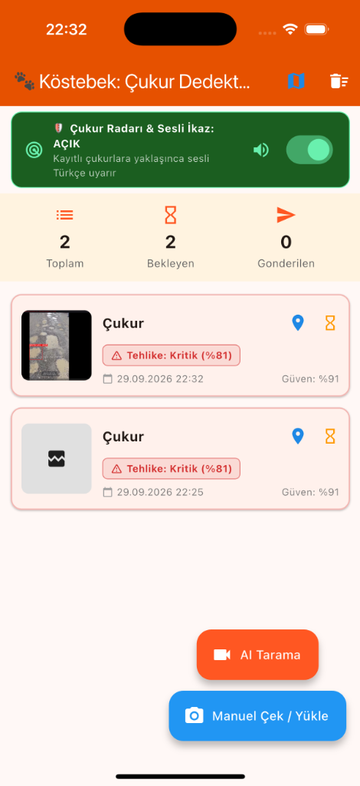

# 🐾 Köstebek: Çukur Dedektörü & Akıllı Sürüş Asistanı

> **Yapay Zeka Destekli Gerçek Zamanlı Yol Çukuru Tespiti, Hız Adaptif Yaklaşma Radarı ve Sesli Sürüş İkaz Sistemi**

[](https://flutter.dev)
[](https://www.tensorflow.org/lite)
[](https://developer.apple.com/ios/)
[](https://developer.android.com)
[](https://github.com/mustafa-akyuz/kostebek/releases/latest)

---

## 📱 Uygulama Ekran Görüntüleri

<p align="center">
  
  
  
  
  
</p>

| 🚨 Yaklaşma Radarı | 🧠 AI Analizi & Damga | 📋 Durum & WhatsApp | 🗺️ Harita Navigasyonu | 📋 Çukur Kayıtları |
| :---: | :---: | :---: | :---: | :---: |
| Yaklaşırken sesli ve görsel ikaz | Derinlik, tehlike ve konum damgası | Tek tuşla belediyeye bildirim | Google & Apple Haritalar | Koordinatlı takip |

---

## 📥 Android APK İndir & Kurulum

Uygulamayı hemen Android telefonunuza yükleyip kullanmaya başlamak için:

👉 **[Köstebek v1.0.0 APK İndir (Resmi GitHub Sürümü)](https://github.com/mustafa-akyuz/kostebek/releases/latest)**

*(Android 8.0 ve üzeri tüm cihazlarla, Xiaomi HyperOS, Samsung One UI ve Google Pixel ile tam uyumludur).*

---

## 🎯 Özellikler

- 🧠 **%100 Cihaz İçi Yapay Zeka (On-Device TFLite):** İnternet veya harici sunucuya ihtiyaç duymadan, XNNPACK / CPU hızlandırmasıyla anlık yol çukuru ve deformasyon tespiti.
- 📡 **Akıllı Çukur Radarı & Türkçe Sesli İkaz (TTS):** Kaydedilen çukurlara yaklaşırken araç hızına göre dinamik mesafe hesabı yaparak sesli Türkçe uyarı verir (*"Dikkat! 120 metre ileride çukur var, yavaşlayın"*).
- 📸 **Canlı AI Kamera Taraması & Manuel Çekim:** Sürüş esnasında otomatik tespit veya araç dururken tek tuşla 1.5x optik odaklı fotoğraf çekimi.
- 🖼️ **Galeriden Görsel Yükleme:** Daha önce yolda çekilmiş fotoğrafları albümden seçip yapay zekaya taratma ve sisteme koordinatlı kaydetme.
- 🏷️ **Görsel Üzerine Otomatik Damgalama:** Çukur kutusunu, güvenilirlik oranını ve tehlike derecesini (Hafif, Orta, Yüksek, Kritik) fotoğrafın üzerine kalıcı olarak işler.
- 🗺️ **Tek Tuşla Navigasyon:** Tespit edilen çukurun konumunu Google Haritalar veya Apple Haritalar'da açarak doğrudan navigasyon başlatma.
- 📲 **Hızlı Raporlama (WhatsApp & SMS):** Belediye veya yol bakım ekiplerine koordinat, adres ve fotoğraf ile anında WhatsApp/SMS şablonu gönderme.
- 🛠️ **Tamir Takip Sistemi:** "Bekliyor", "Bildirildi" ve "Tamir Edildi" durum yönetimi.

---

## 🏗️ Mimari & Teknolojiler

- **Framework:** Flutter & Dart
- **AI / ML Motoru:** TensorFlow Lite (`tflite_flutter`), 640x640 YOLO mimarisi
- **Yerel Veritabanı:** Hive NoSQL (Offline-first, hızlı I/O)
- **Görüntü İşleme:** Dart `image` kütüphanesi ile koordinat ve hasar damgalama
- **Ses & Konuşma:** `flutter_tts` (Türkçe yerel motor)
- **Konum Servisleri:** `geolocator` & `geocoding` (Mesafe matrisi ve ters coğrafi kodlama)
- **Görsel Seçici:** `image_picker` (Android 15 PhotoPicker & iOS PHPicker uyumlu)

---

## 🚀 Geliştirici Kurulumu & Çalıştırma

### Gereksinimler
- Flutter SDK `>=3.5.0`
- Xcode 15+ (iOS için)
- Android SDK 34+ (Android için)

### Bağımlılıkları İndirme
```bash
flutter pub get
```

### Android Release APK Derleme
```bash
flutter build apk --release
```
*Çıktı konumu: `build/app/outputs/flutter-apk/app-release.apk`*

### iOS Simülatöründe Çalıştırma
```bash
pod install --project-directory=ios
flutter run -d iPhone
```

---

## 📄 Lisans
Bu proje MIT lisansı ile lisanslanmıştır.
